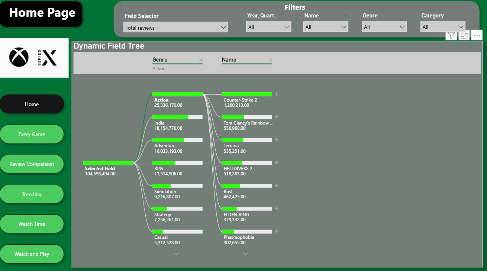
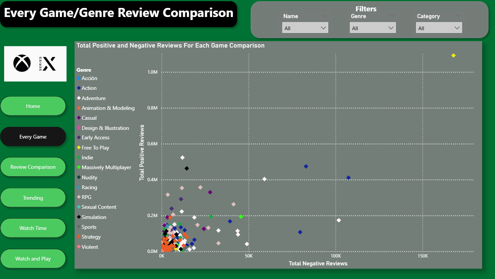
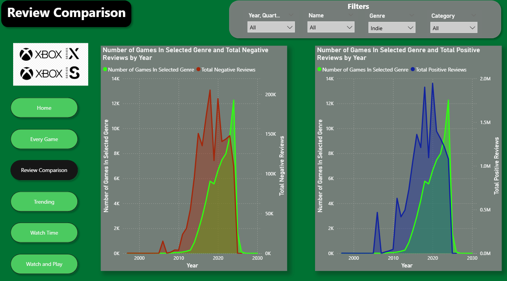
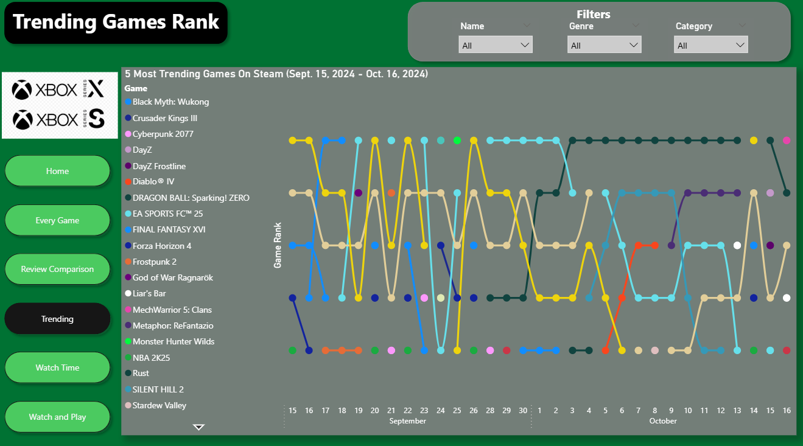
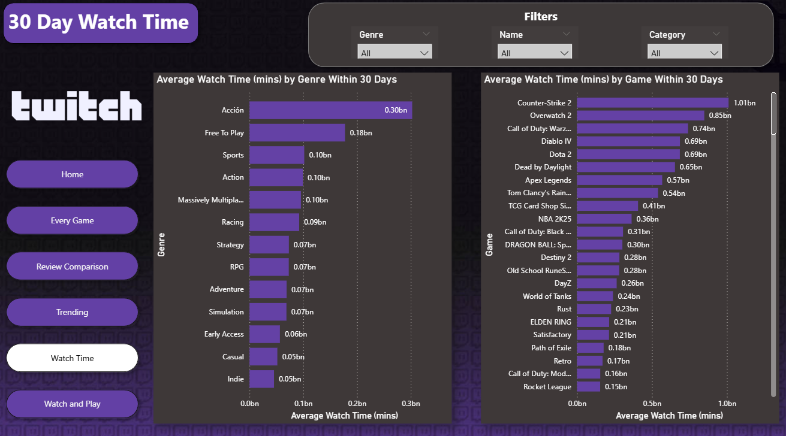
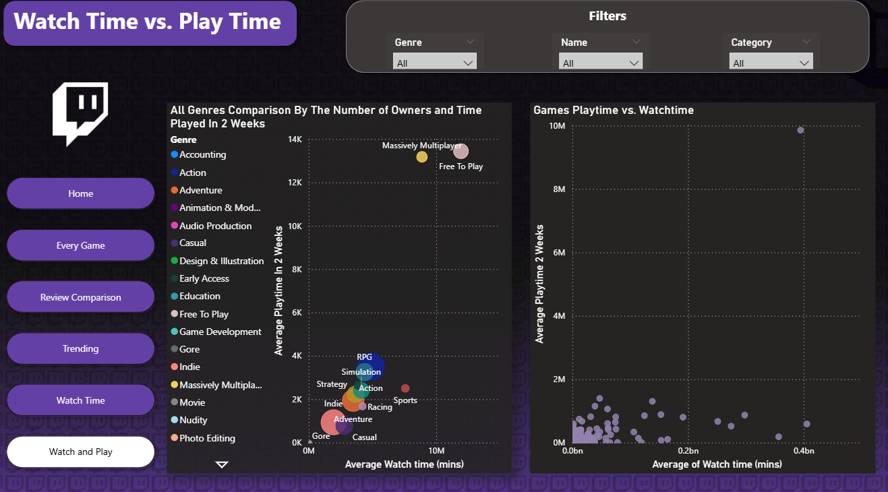

# Steam & Twitch Market Saturation, Reviews, and Competitive Dynamics
## Executive Summary
This project examines the relationship between Steam game market saturation, user review sentiment, and Twitch engagement to assess competitiveness across genres and individual titles. By integrating review volume, positive versus negative sentiment, release timing, and watch/play time metrics, the analysis highlights which games achieve sustained success versus those driven by short-term trends. The findings show that strong review performance does not always translate into high viewer engagement, revealing a disconnect between player adoption and audience interest. Overall, the project provides a holistic, data-driven perspective on how consumer sentiment, market competition, and streaming behavior interact within the PC gaming ecosystem.

## Data Model

  
  

  
  

## Dashboard Pages

  
  

  
  

  
  

## Key Insights
**Market Saturation Does Not Guarantee Engagement**
- Action and Indie genres dominate total review volume on Steam, indicating heavy market saturation, but this does not consistently translate into high Twitch watch time. Several highly reviewed games show relatively low viewer engagement, suggesting that player adoption and spectator interest follow different dynamics.

**A Small Number of Titles Drive Disproportionate Attention**
- Across both reviews and watch time, a small subset of games (e.g., Counter-Strike 2, major live-service titles) account for a large share of total engagement. This “winner-take-most” pattern highlights a highly competitive environment where new releases must compete not just within their genre, but against entrenched market leaders.
  - Some of these titles, such as Counter-Strike 2 have massive, well established e-sports scene (competitive play).

## Future Extensions

## Limitations & Assumptions
- Genre categorization was non-trivial because games often have multiple genre tags, leading to multiple rows per game. As a result, genre-level analysis reflects tag presence rather than mutually exclusive genre classification.
- Some games contained corrupted or incomplete Steam records and were excluded from the Steam analysis. These titles still appear in Twitch data where available, which may cause minor discrepancies between platform comparisons.

## Tools & Skills Demonstrated

